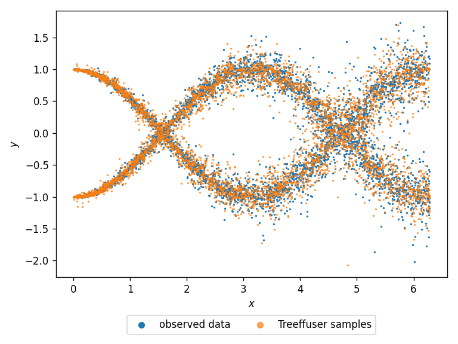

# Treeffuser

[](https://badge.fury.io/py/treeffuser)
[](https://opensource.org/licenses/MIT)
[](https://github.com/blei-lab/treeffuser/stargazers)
[](https://pepy.tech/project/treeffuser/)
[](https://blei-lab.github.io/treeffuser/)
[](https://blei-lab.github.io/treeffuser/docs/getting-started.html)
[](https://arxiv.org/abs/2406.07658)

Treeffuser is an easy-to-use package for **probabilistic prediction on tabular data with tree-based diffusion models**.
It estimates distributions of the form `p(y|x)` where `x` is a feature vector and `y` is a target vector.
Treeffuser can model conditional distributions `p(y|x)` that are arbitrarily complex (e.g., multimodal, heteroscedastic, non-Gaussian, heavy-tailed, etc.).

It is designed to adhere closely to the scikit-learn API and require minimal user tuning.

<h3 align="center">
        <b><a href="https://blei-lab.github.io/treeffuser/">Website</a></b> |
        <b><a href="https://github.com/blei-lab/treeffuser/">GitHub</a></b> |
        <b><a href="https://blei-lab.github.io/treeffuser/docs/getting-started.html">Documentation</a></b> |
        <b><a href="https://arxiv.org/abs/2406.07658">Paper (NeurIPS 2024)</a></b>
</h3>


## Installation

Install Treeffuser from PyPI:

```bash
pip install treeffuser
```

Install the development version:

```bash
pip install git+https://github.com/blei-lab/treeffuser.git@main
```

The GitHub repository is located at: https://github.com/blei-lab/treeffuser


## Usage Example

Here's a simple example demonstrating how to use Treeffuser.

We generate a heteroscedastic response with two sinusoidal components and heavy tails.

```python
import matplotlib.pyplot as plt
import numpy as np
from treeffuser import Treeffuser, Samples

# Generate data
seed = 0
rng = np.random.default_rng(seed=seed)
n = 5000
x = rng.uniform(0, 2 * np.pi, size=n)
z = rng.integers(0, 2, size=n)
y = z * np.sin(x - np.pi / 2) + (1 - z) * np.cos(x) + rng.laplace(scale=x / 30, size=n)
```

We fit Treeffuser and generate samples. We then plot the samples against the raw data.

```python
# Fit the model
model = Treeffuser(seed=seed)
model.fit(x, y)

# Generate and plot samples
y_samples = model.sample(x, n_samples=1, seed=seed, verbose=True)
plt.scatter(x, y, s=1, label="observed data")
plt.scatter(x, y_samples[0, :], s=1, alpha=0.7, label="Treeffuser samples")
```



Treeffuser accurately learns the target conditional densities and can generate samples from them.

These samples can be used to compute any downstream estimates of interest:

```python
y_samples = model.sample(x, n_samples=100, verbose=True)  # y_samples.shape[0] is 100

# Estimate downstream quantities of interest
y_mean = y_samples.mean(axis=0)  # conditional mean
y_std = y_samples.std(axis=0)    # conditional std
```

You can also use the `Samples` helper class:

```python
y_samples = Samples(y_samples)
y_mean = y_samples.sample_mean()
y_std = y_samples.sample_std()
y_quantiles = y_samples.sample_quantile(q=[0.05, 0.95])
```

See the documentation for more information on available methods and parameters.

## FAQ:

**Sampling Speed Issues**: Some users have reported slow sampling speeds. If this is your case you can get significant improvements by reducing either of these two hyper-parameters: `n_estimators` or `early_stopping_rounds`. 

---

## Citing Treeffuser

If you use Treeffuser in your work, please cite:

```bibtex
@article{beltranvelez2024treeffuser,
  title={Treeffuser: Probabilistic Predictions via Conditional Diffusions with Gradient-Boosted Trees},
  author={Nicolas Beltran-Velez and Alessandro Antonio Grande and Achille Nazaret and Alp Kucukelbir and David Blei},
  year={2024},
  eprint={2406.07658},
  archivePrefix={arXiv},
  primaryClass={cs.LG},
  url={https://arxiv.org/abs/2406.07658},
}
```
