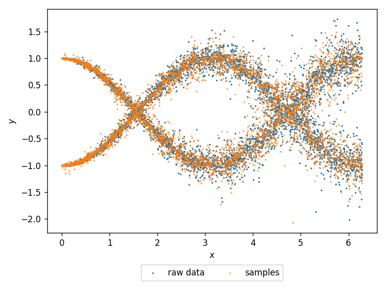

====================
Treeffuser
====================
.. raw:: html

    

        
        
        
        
    

.. raw:: html

    

        
        
        
        
    

Treeffuser is an easy-to-use package for **probabilistic prediction on tabular data with tree-based diffusion models**.
It estimates distributions of the form ``p(y|x)`` where ``x`` is a feature vector and ``y`` is a target vector.
Treeffuser can model conditional distributions ``p(y|x)`` that are arbitrarily complex (e.g., multimodal, heteroscedastic, non-gaussian, heavy-tailed, etc.).

It is designed to adhere closely to the scikit-learn API and require minimal user tuning.

Treeffuser is detailed in the paper: `Treeffuser: Probabilistic Predictions via Conditional Diffusions with Gradient-Boosted Trees <https://arxiv.org/abs/2406.07658>`_.

Installation
============

You can install Treeffuser via pip from PyPI with the following command:

.. code-block:: bash

    pip install treeffuser

You can also install the development version with:

.. code-block:: bash

    pip install git+https://github.com/blei-lab/tree-diffuser.git@main

Usage Example
=============

Here's a simple example demonstrating how to use Treeffuser.

We generate an heteroscedastic response with two sinusoidal components and heavy tails.

.. code-block:: python

    import matplotlib.pyplot as plt
    import numpy as np
    from treeffuser import Treeffuser, Samples

    # Generate data
    seed = 0
    rng = np.random.default_rng(seed=seed)
    n = 5000
    x = rng.uniform(0, 2 * np.pi, size=n)
    z = rng.integers(0, 2, size=n)
    y = z * np.sin(x - np.pi / 2) + (1 - z) * np.cos(x) + rng.laplace(scale=x / 30, size=n)

We fit Treeffuser and generate samples. We then plot the samples against the raw data.

.. code-block:: python

    # Fit the model
    model = Treeffuser(seed=seed)
    model.fit(x, y)

    # Generate and plot samples
    y_samples = model.sample(x, n_samples=1, seed=seed, verbose=True)
    plt.scatter(x, y, s=1, label="observed data")
    plt.scatter(x, y_samples[0, :], s=1, alpha=0.7, label="Treeffuser samples")

Treeffuser accurately learns the target conditional densities and can generate samples from them.

These samples can be used to compute any downstream estimates of interest.

.. code-block:: python

    y_samples = model.sample(x, n_samples=100, verbose=True) # y_samples.shape[0] is 100

    # Estimate downstream quantities of interest
    y_mean = y_samples.mean(axis=0) # conditional mean for each x
    y_std = y_samples.std(axis=0) # conditional std for each x

For convenience, we also provide a class ``Samples`` that can estimate standard quantities.

.. code-block:: python

    y_samples = Samples(y_samples)
    y_mean = y_samples.sample_mean() # same as before
    y_std = y_samples.sample_std() # same as before
    y_quantiles = y_samples.sample_quantile(q=[0.05, 0.95]) # conditional quantiles for each x

Please take a look at the documentation for more information on the available methods and parameters.

Citing Treeffuser
=================

If you use Treeffuser or this codebase in your work, please cite the following paper:

.. code-block:: bibtex

    @article{beltran2024treeffuser,
      title={Treeffuser: Probabilistic Predictions via Conditional Diffusions with Gradient-Boosted Trees},
      author={Beltran-Velez, Nicolas and Grande, Alessandro Antonio and Nazaret, Achille and Kucukelbir, Alp and Blei, David},
      journal={arXiv preprint arXiv:2406.07658},
      year={2024}
    }
